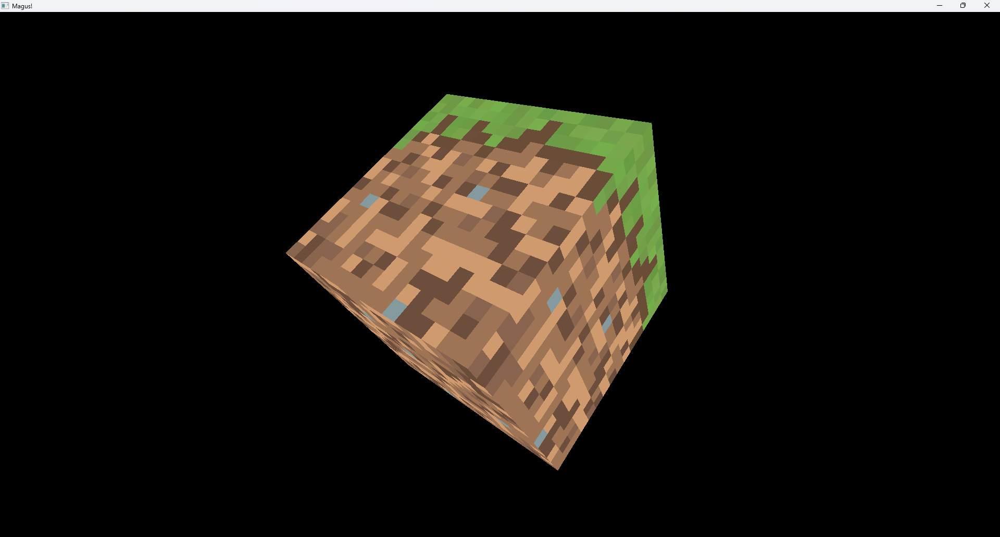

# 🚀 Java OpenGL Game Engine (LWJGL)

A simple **game engine** built using **Java** and **LWJGL** (Lightweight Java Game Library).  
Currently, the engine **renders a rotating 3D cube**, allowing movement via **keyboard (arrow keys)** and **mouse-controlled camera**.

---

## 🎮 Features (So Far)
✔️ **Rotating 3D Cube** (Rendered using OpenGL)  
✔️ **Keyboard Controls** (Move the cube with arrow keys)  
✔️ **Mouse Camera Control** (Look around freely)

---

## 🖼️ Screenshot
Here’s a preview of the engine in action:



---

## 🛠️ Technologies Used
- **Java**
- **LWJGL (Lightweight Java Game Library)**
- **OpenGL**

---

## 🚀 How to Run
1. **Clone the repository**
   ```sh
   git clone https://github.com/HamzaOuggadi/Magus
